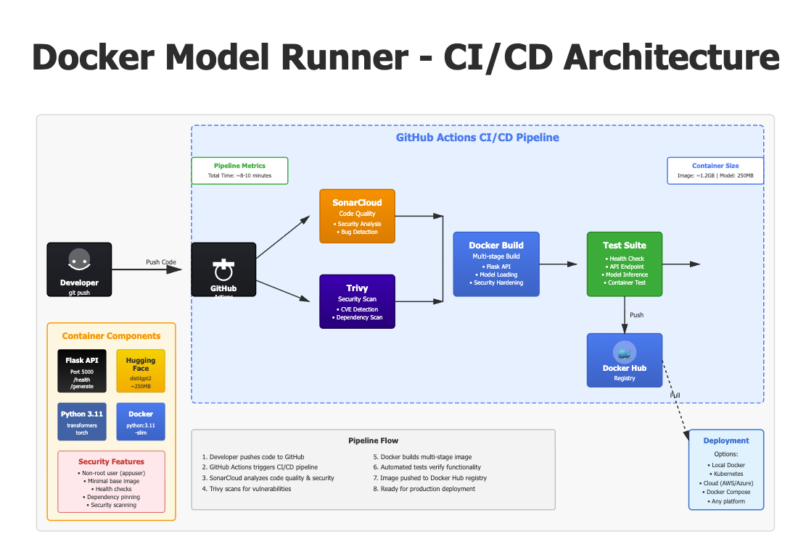

# Docker Model Runner with CI/CD

Docker-based ML model runner using Hugging Face's distilgpt2 for text generation, with automated GitHub Actions pipeline for building, testing, and deploying secure Docker images.

## What is a Model Runner?

A **model runner** is a containerized service that loads a machine learning model and exposes it via an API. This project demonstrates:

- 🤖 **ML Model Serving**: Hugging Face transformers (distilgpt2) for text generation
- 🐳 **Docker Containerization**: Multi-stage builds with security hardening
- 🔄 **CI/CD Automation**: GitHub Actions for automated builds and deployments
- 🔒 **Security Scanning**: Trivy and SonarCloud for vulnerability detection
- 📊 **Code Quality**: Automated code analysis with SonarCloud

## Architecture



*The complete CI/CD pipeline from code push to deployment*

## Project Structure

```
docker-model-runner/
├── README.md                    # This file
├── app.py                       # Flask API with model runner
├── requirements.txt             # Python dependencies
├── Dockerfile                   # Multi-stage Docker build
├── Makefile                     # Development commands
├── .gitignore                   # Git exclusions
├── .dockerignore               # Docker build exclusions
└── .github/
    └── workflows/
        └── docker-build.yml    # CI/CD pipeline
```

## Quick Start

### Prerequisites

- Docker Desktop installed and running
- GitHub account
- Docker Hub account
- SonarCloud account (optional but recommended)

### Step 1: Fork and Clone Repository

1. **Fork this repository** on GitHub (click "Fork" button at the top right)
2. Clone **your fork** locally:
```bash
git clone https://github.com/theCaptN21/docker-model-runner.git
cd docker-model-runner
```
Replace `YOUR_USERNAME` with your GitHub username.

### Step 2: Configure SonarCloud (Recommended)

**Why SonarCloud?** It provides automated code quality and security analysis on every push.

1. **Sign up at https://sonarcloud.io**
   - Click "Log in" → "With GitHub"
   - Authorize SonarCloud

2. **Import Your Repository**
   - Click "+" → "Analyze new project"
   - Select your organization (GitHub username)
   - Choose `docker-model-runner`
   - Click "Set Up"

3. **Get Your Token**
   - Click profile icon → My Account → Security
   - Generate new token:
     - Name: `github-actions`
     - Type: `User Token`
     - Expiration: No expiration (for personal projects)
   - **Copy the token immediately**

4. **Add Secrets to GitHub**
   - Go to your repository on GitHub
   - Settings → Secrets and variables → Actions
   - Click "New repository secret" and add these three secrets:
   
   **Secret 1: SONAR_TOKEN**
   - Name: `SONAR_TOKEN`
   - Value: Your token from step 3
   
   **Secret 2: SONAR_PROJECT_KEY**
   - Name: `SONAR_PROJECT_KEY`
   - Value: Copy from SonarCloud Project Information (e.g., `theCaptN21_docker-model-runner`)
   
   **Secret 3: SONAR_ORGANIZATION**
   - Name: `SONAR_ORGANIZATION`
   - Value: Copy from SonarCloud Project Information (e.g., `thecaptn21`)

### Step 3: Configure Docker Hub

1. **Create Docker Hub Access Token**
   - Log in to hub.docker.com
   - Account Settings → Security → New Access Token
   - Description: `github-actions`
   - Access permissions: Read, Write, Delete
   - **Copy the token immediately**

2. **Add Secrets to GitHub**
   - Go to Settings → Secrets and variables → Actions
   - Add two secrets:
     - `DOCKERHUB_USERNAME`: Your Docker Hub username
     - `DOCKERHUB_TOKEN`: Your access token from above

### Step 4: Test Locally (Optional but Recommended)

Before pushing to GitHub, verify everything works:

```bash
# Build the Docker image
make build

# Run the container
make run

# In another terminal, test the API
curl http://localhost:5000/health

curl -X POST http://localhost:5000/generate \
  -H "Content-Type: application/json" \
  -d '{"prompt": "The future of AI is", "max_length": 50}'

# Stop the container
make clean
```

### Step 5: Push to GitHub

```bash
git add .
git commit -m "Initial commit: Docker Model Runner"
git push origin main
```

### Step 6: Verify Pipeline

1. Go to your repository → Actions tab
2. Watch the workflow run (takes ~5-10 minutes)
3. Verify all stages pass:
   - ✅ SonarCloud Analysis (code quality)
   - ✅ Security Scan (Trivy vulnerabilities)
   - ✅ Build and Test (Docker image)
   - ✅ Push to Registry (Docker Hub)
   - ✅ Post-Deployment (documentation)

## Local Testing & Verification

### Test the Model Runner

```bash
# Start the container
docker run -d -p 5000:5000 --name model-runner YOUR_DOCKERHUB_USERNAME/docker-model-runner:latest

# Wait for model to load (check logs)
docker logs -f model-runner

# Test health endpoint
curl http://localhost:5000/health
# Expected: {"status":"healthy"}

# Test text generation
curl -X POST http://localhost:5000/generate \
  -H "Content-Type: application/json" \
  -d '{"prompt": "Once upon a time", "max_length": 100}'

# Stop container
docker stop model-runner && docker rm model-runner
```

### Prove It's a Model Runner

**Test 1: Health Check (Server Running)**
```bash
curl http://localhost:5000/health
```
Output: `{"status":"healthy"}` - proves Flask API is running

**Test 2: Generate Text (Model Loaded)**
```bash
curl -X POST http://localhost:5000/generate \
  -H "Content-Type: application/json" \
  -d '{"prompt": "Hello world", "max_length": 30}'
```
Output shows generated text - proves distilgpt2 model is loaded and generating

**Test 3: Different Prompts (Model Intelligence)**
```bash
# Creative writing
curl -X POST http://localhost:5000/generate \
  -H "Content-Type: application/json" \
  -d '{"prompt": "In a galaxy far away", "max_length": 50}'

# Technical content
curl -X POST http://localhost:5000/generate \
  -H "Content-Type: application/json" \
  -d '{"prompt": "Machine learning is", "max_length": 50}'
```
Different outputs for different prompts - proves model is doing inference

### Make a Code Change & See It Deploy

**Step 1: Modify the model prompt processing**

Edit `app.py`, find the generate function and add this line after getting the prompt:

```python
# Add this line to make prompts more creative
prompt = f"[CREATIVE] {prompt}"
```

**Step 2: Test locally**
```bash
docker build -t model-runner:test .
docker run -d -p 5000:5000 --name test model-runner:test

curl -X POST http://localhost:5000/generate \
  -H "Content-Type: application/json" \
  -d '{"prompt": "Hello", "max_length": 30}'

# Notice the prompt now has [CREATIVE] prefix in the response
```

**Step 3: Push the change**
```bash
git add app.py
git commit -m "Add creative prefix to prompts"
git push origin main
```

**Step 4: Watch automated deployment**
- GitHub Actions runs automatically
- New image built and pushed to Docker Hub
- Pull the new image and see your change in production

```bash
docker pull YOUR_DOCKERHUB_USERNAME/docker-model-runner:latest
docker run -d -p 5000:5000 YOUR_DOCKERHUB_USERNAME/docker-model-runner:latest
# Test and see the [CREATIVE] prefix in responses
```

## CI/CD Pipeline Stages

### 1. SonarCloud Analysis
- Analyzes code quality and security
- Detects bugs, vulnerabilities, code smells
- Reports technical debt
- **Runs first to catch issues early**

### 2. Security Scanning (Trivy)
- Scans dependencies for known CVEs
- Reports CRITICAL, HIGH, MEDIUM, LOW vulnerabilities
- Shows which versions fix issues
- Scans both filesystem and Docker image

### 3. Build and Test
- Multi-stage Docker build (builder + runtime)
- Security hardening (non-root user, minimal base)
- Automated health checks
- API endpoint testing
- Container verification

### 4. Push to Docker Hub
- Multiple tags: `latest`, `main-<sha>`, branch name
- OCI-compliant metadata
- Automated on successful builds
- Available immediately after push

### 5. Post-Deployment
- Updates Docker Hub description
- Generates build summaries
- Provides deployment commands

## Docker Image Features

### Multi-Stage Build
```dockerfile
# Stage 1: Builder (dependencies compilation)
FROM python:3.11-slim AS builder
# Install and compile dependencies

# Stage 2: Runtime (minimal production image)
FROM python:3.11-slim
# Copy only what's needed, run as non-root
```

**Benefits:**
- 300MB smaller final image
- No build tools in production
- Reduced attack surface
- Faster deployments

### Security Hardening

1. **Non-root User**
   - Runs as `appuser` (not root)
   - Limited permissions
   - Prevents privilege escalation

2. **Minimal Base Image**
   - `python:3.11-slim` (only essentials)
   - Fewer packages = fewer vulnerabilities
   - Regular security updates

3. **Health Checks**
   - Monitors container health
   - Auto-restart on failures
   - Integration with orchestrators

4. **Dependency Pinning**
   - Exact versions in requirements.txt
   - Reproducible builds
   - Controlled updates

## Available Commands (Makefile)

```bash
make help          # Show available commands
make build         # Build Docker image locally
make test          # Build and run full test suite
make run           # Run container locally
make clean         # Stop and remove containers/images
```

## Understanding the Model Runner API

### Endpoints

**GET /health**
```bash
curl http://localhost:5000/health
```
Response: `{"status": "healthy"}`

**POST /generate**
```bash
curl -X POST http://localhost:5000/generate \
  -H "Content-Type: application/json" \
  -d '{
    "prompt": "Your text here",
    "max_length": 50
  }'
```

Response:
```json
{
  "prompt": "Your text here",
  "generated_text": "Your text here and the model continues..."
}
```

### Model Information

- **Model**: distilgpt2 (Hugging Face)
- **Task**: Text generation
- **Size**: ~250MB
- **Type**: Transformer-based language model
- **Use Cases**: Text completion, creative writing, content generation

## Monitoring & Observability

### View SonarCloud Dashboard

1. Go to https://sonarcloud.io/projects
2. Click `docker-model-runner`
3. View:
   - **Overview**: Quality gate status
   - **Issues**: Bugs, vulnerabilities, code smells
   - **Security**: Security hotspots
   - **Measures**: Metrics and coverage

### View Security Scan Results

1. Go to repository → Actions tab
2. Click latest workflow run
3. Expand "Security Scanning" job
4. View Trivy output with CVE details

### Check Docker Hub

1. Go to hub.docker.com
2. Navigate to your repository
3. View available tags
4. Check image layers and size

## Troubleshooting

### Pipeline Fails on First Run

**SonarCloud Error:**
- Ensure `SONAR_TOKEN` secret is added
- Verify project name is `docker-model-runner` in SonarCloud
- Check organization name matches your GitHub username

**Docker Push Error:**
- Verify `DOCKERHUB_USERNAME` and `DOCKERHUB_TOKEN` secrets
- Ensure Docker Hub token has write permissions
- Repository will be created automatically on first push

### Container Won't Start

```bash
# Check logs
docker logs model-runner

# Common issues:
# - Port 5000 already in use: use -p 5001:5000
# - Model download failed: check internet connection
# - Memory issues: Docker Desktop needs 4GB+ RAM
```

### Model Takes Long to Load

First run downloads the model (~250MB):
- Wait 30-60 seconds
- Check logs: `docker logs -f model-runner`
- Look for "Model loaded successfully"

## Best Practices

1. **Always test locally before pushing**
2. **Monitor pipeline results**
3. **Keep dependencies updated**
4. **Use meaningful commit messages**
5. **Review code quality**

## Security Considerations

Current dependencies (all vulnerabilities fixed):

```python
flask==3.1.0          # Latest stable
transformers==4.48.0  # All CVEs fixed
torch==2.5.1          # Stable version
numpy==2.1.0          # Latest stable
